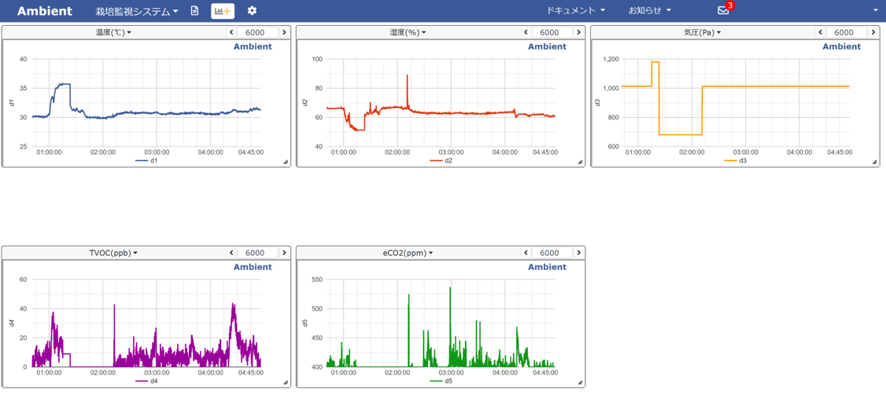
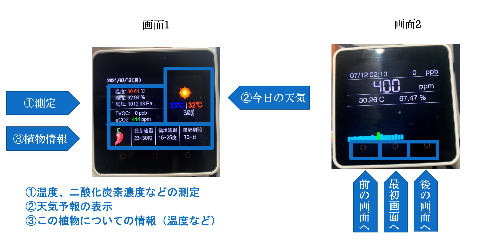

  <h1>M5Core2_PlantMonitoring</h1>
  
Check the condition of plants in real time, and remote monitoring is also possible by using Ambient

  

  
  
  
  

## 画像

 

 

## 機材

* [M5Stack core2](https://www.switch-science.com/catalog/6530/?gclid=CjwKCAjwos-HBhB3EiwAe4xM91I_s5RNMDbxmOKW6gQTxaCGehTAYyTGQJEdJuMRq9mXrbNsyZOVvRoCdrEQAvD_BwE)
* [M5Stack用環境センサユニット ver.2（ENV II）](https://www.switch-science.com/catalog/6344/)
* [TVOC/eCO2 ガスセンサユニット（SGP30）](https://www.switch-science.com/catalog/6619/)

## 実行例

### M5Core2

 

 

### Ambient

 

 

## 参考

[1] [刺すだけ簡単！ M5Stackで環境監視システムをつくる！（Co2・TVOC・温度・湿度・気圧）](https://note.com/rasen/n/nfbea0aa587dc)

[2] [M5Stack 二酸化炭素計測グラフ表示とスタッキングケース作成でケーブルスッキリ](https://bey.jp/?p=89676)

[3]“M5Stackで作るウェブ情報収集＆表示ガジェット〈第1回〉JSONデータで取得した天気情報を表示する“ ，Inter face（インターフェース）， ２０２０年１２月号， pp.149-154.

